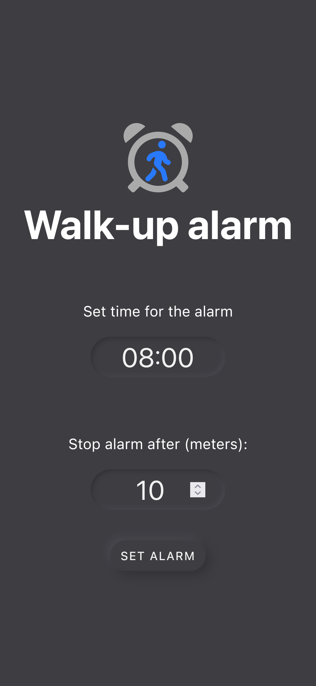

# Walk-up alarm


Alarm clock ringing until you walk out of the bed.

<p>
  See it in action:
  <a href="https://nzambello.github.io/walk-up-alarm/" target="_blank" rel="noopener noreferrer">
    nzambello.github.io/walk-up-alarm
  </a>
</p>
<p>It's a <a href="https://en.wikipedia.org/wiki/Progressive_web_application" target="_blank" rel="noopener noreferrer">PWA</a>. Install it on your device!</p>
<br />
<a href="https://nzambello.github.io/walk-up-alarm/" target="_blank" rel="noopener noreferrer">
  
</a>
<br />

## Screenshots

<p float="left">
  
  
  
</p>
<br />

## Development

```bash
yarn install
```

### Run the app

```bash
yarn dev
```

### Build the app

```bash
yarn build
yarn preview
```

### Run tests

```bash
yarn test
```

## Contributions

Please follow our [convention](COMMITLINT.md) on commits format.
